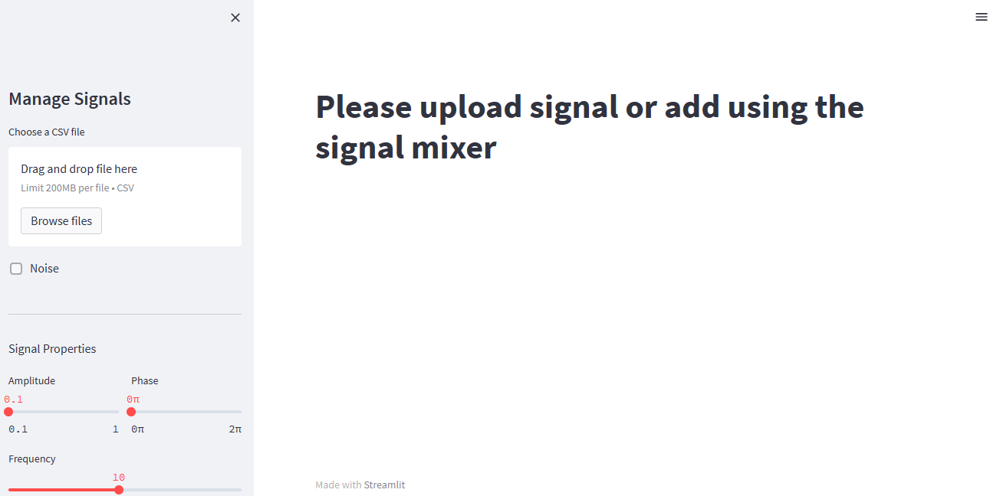
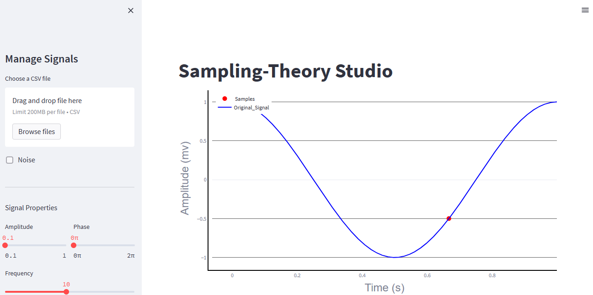
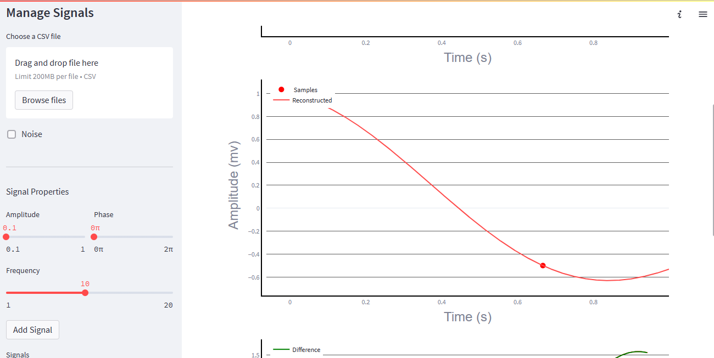
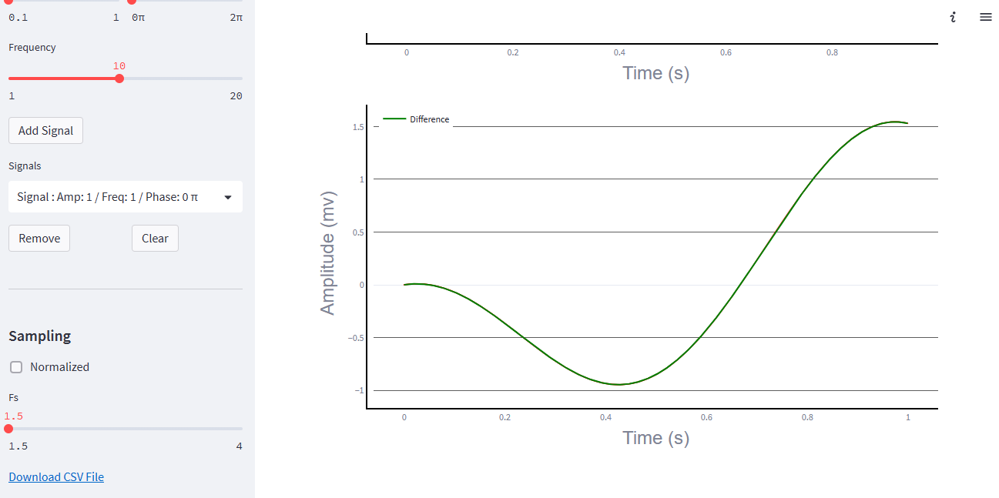
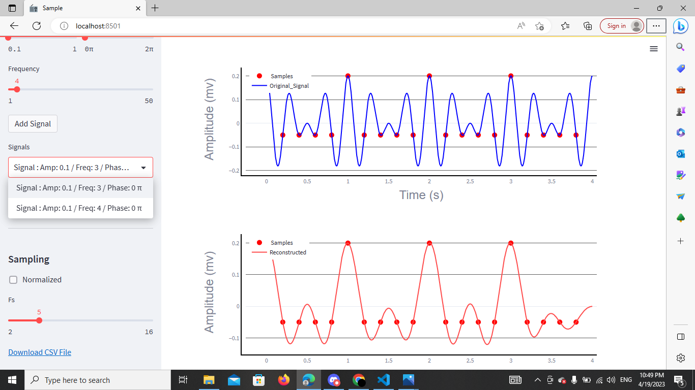
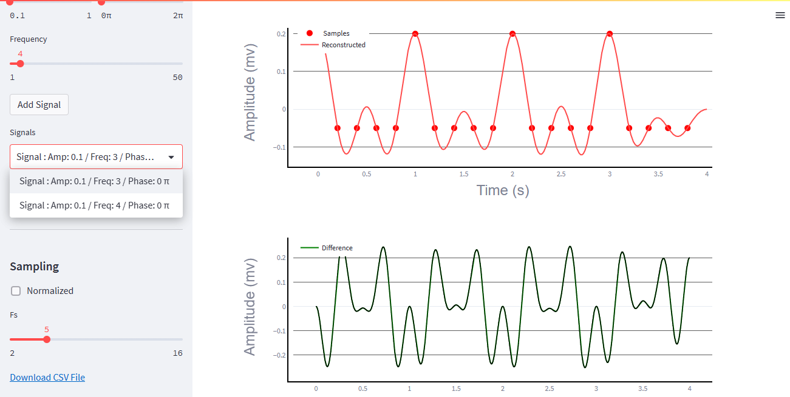
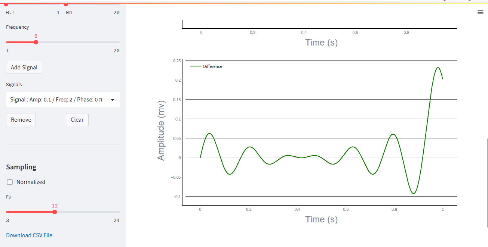
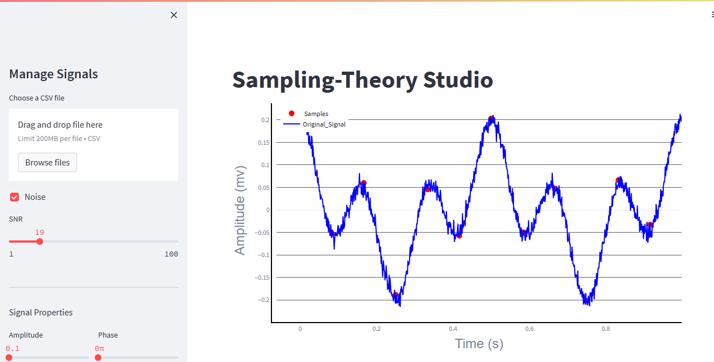
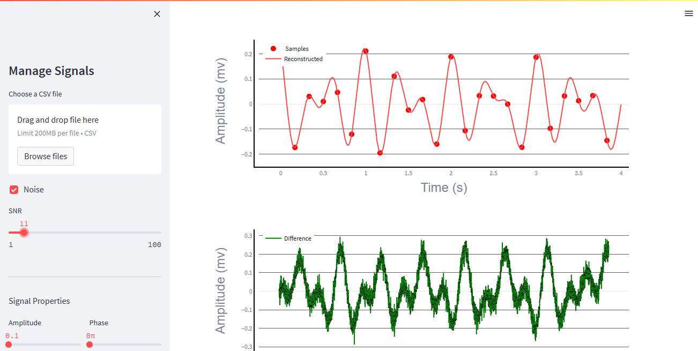

# -Sampling-Theory-Studio
 Sampling-Theory Studio is a web application built using Streamlit open source framework illustrating analog signal sampling and reconstruction to validate and show the importance of the Shannon-Nyquist sampling theorem .
## Table of Contents

- [Built with](#Built-with)
- [Deployment](#Deployment)
- [Design](#Design)
- [Features](#Features)

## Built with


## Deployment

 Install streamlit

```bash
  pip install streamlit
```
Install used modules

```bash
requirements-txt init
```
To start deployment 
```bash
  streamlit run streamlit_app.py
```
## 🖌️ Design





## Features
* **Sampling**




* **Add noise**




