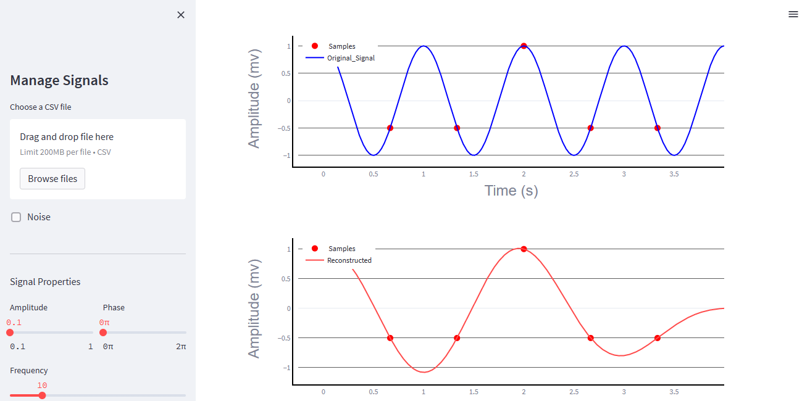

# Sampling-Theory-Studio
 Sampling-Theory Studio is a web application built using Streamlit open source framework illustrating analog signal sampling and reconstruction to validate and show the importance of the Shannon-Nyquist sampling theorem.
## Table of Contents

- [Built with](#Built-with)
- [Deployment](#Deployment)
- [Design](#Design)
- [Features](#Features)
- [Authors](#Authors)
- [Acknowledgements](#Acknowledgements)
 Acknowledgements
## Built with


## Deployment

 Install streamlit

```bash
  pip install streamlit
```
Install used modules

```bash
requirements-txt init
```
To start deployment 
```bash
  streamlit run streamlit_app.py
```
## Design



## Features
* **Sampling**


* **Add noise**


## Authors

| Name | GitHub | LinkedIn |
| ---- | ------ | -------- |
| Omar Adel Hassan | [@Omar_Adel](https://github.com/omar-adel1) | [](https://www.linkedin.com/in/omar-adel-59b707231/) |
| Sharif Ehab | [@Sharif_Ehab](https://github.com/SharifEhab) | [](https://www.linkedin.com/in/sharif-elmasry-b167a3252/) |
| Mostafa Khaled | [@Mostafa_Khaled](https://github.com/MostafaDarwish93) | [](https://www.linkedin.com/in/mostafa-darwish-75a29225b/) |
| Zyad Sowalim | [@Zyad_Sowalim](https://github.com/Zyadsowilam) | [](https://www.linkedin.com/in/zyad-sowilam-798209228/) |

## Acknowledgements

Submitted to: Dr. Tamer Basha & Eng. Christina Adly

All rights reserved © 2023 to Team 4 - HealthCare Engineering and Management, Cairo University (Class 2025)

